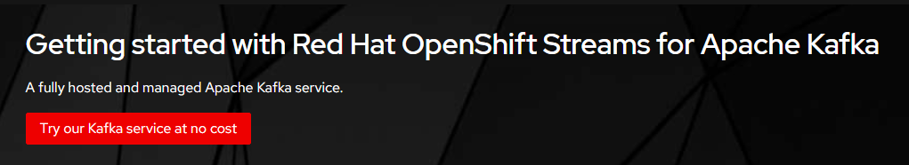
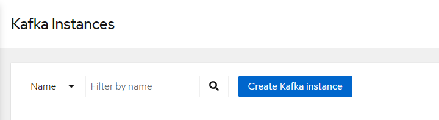
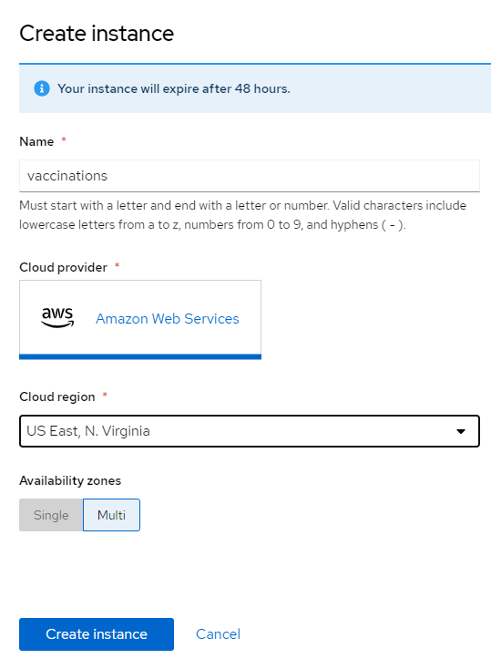
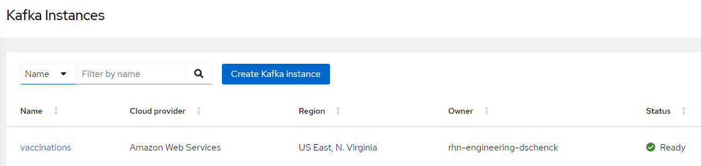
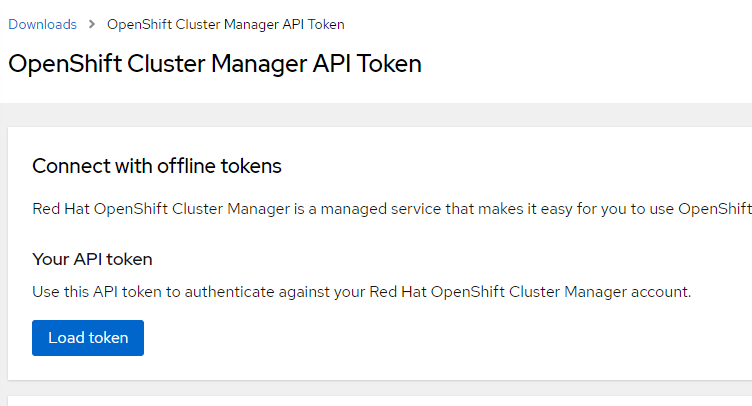
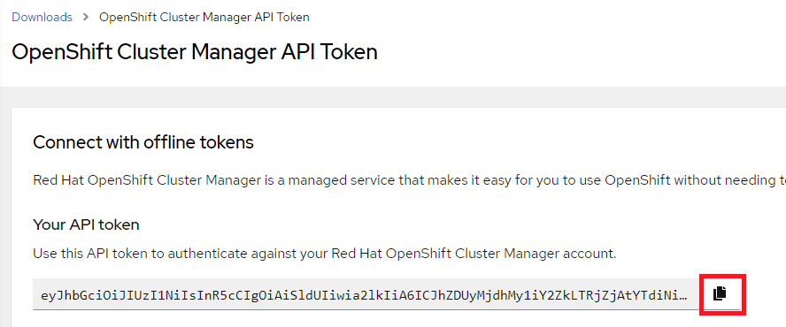

# vac-seen-managed-kafka
Instructions for preparing the managed kafka instance and topic to be use by the "vac-seen" system.


## Prerequisites  
The following prerequisites are necessary:  
1. An account in Red Hat OpenShift Sandbox (No problem; it's free). This is not actually *necessary*, since you can use this tutorial with any OpenShift cluster *as long as the Service Binding Operator is installed*.  If you don't have access to a cluster with the Service Binding Operator, or just want to experiment on your own, the OpenShift Sandbox is perfect.    
1. The `oc` command-line tool for OpenShift. There are instructions later in this article for the installation of `oc`.
1. The `rhoas` command-line tool for Red Hat service binding. There are instructions later in this article for the installation of `rhoas`.  

## Need help?
If you need help or get stuck, email devsandbox@redhat.com.
If you find a defect, [create an Issue](https://docs.github.com/en/issues/tracking-your-work-with-issues/creating-an-issue) in this repository.

There are seven parts to this activity. Estimated time to complete is 10 minutes.
* Part 0: Install Prerequisites
* Part 1: Create Kafka Instance
* Part 2: Log in to RHOAS
* Part 3: Use instance
* Part 4: Create topic
* Part 5: Connect to cluster
* Part 6: Set ACL
* Part 7: Bind to Deployment

## Part 0: Install Prerequisites
### Step 0.1: Get your cluster
The OpenShift Sandbox is a free offering from Red Hat that gives you developer-level access rights to an OpenShift cluster. If you have not already signed up for this free cluster, do so by visiting [the OpenShift Sandbox web page](https://developers.redhat.com/developer-sandbox).  

If you are using your own cluster, [the Service Binding Operator must be installed](https://docs.openshift.com/container-platform/4.9/applications/connecting_applications_to_services/installing-sbo.html).  

### Step 0.2: Install the 'oc' CLI  
The `oc` command line interface (CLI) allows you to work with your OpenShift cluster from a terminal command line. The `oc` CLI for OpenShift can be installed by following the instructions on [the oc CLI Getting Started web page](https://docs.openshift.com/container-platform/4.9/cli_reference/openshift_cli/getting-started-cli.html).

### Step 0.3: Log in to your cluster from the command line
Open a terminal session on your local machine and use the `oc login` command to log into your cluster from there. The instructions for doing that are in [this short article](https://developers.redhat.com/blog/2021/04/21/access-your-developer-sandbox-for-red-hat-openshift-from-the-command-line).  This can be done using macOS, Windows, and Linux.

### Step 0.4: Install the 'rhoas' CLI
The `rhoas` (Red Hat OpenShift Application Services) CLI can be installed by following the instructions on [the `rhoas` CLI installation page](https://access.redhat.com/documentation/en-us/red_hat_openshift_application_services/1/guide/b9d4f17b-923f-49a6-b513-954399fc2ddd). This CLI is needed to use the Service Binding that connects your Kafka instance to your application.

## Part 1: Create Kafka Instance
### Step 1.1 
Go to https://developers.redhat.com/products/red-hat-openshift-streams-for-apache-kafka/getting-started  

### Step 1.2
Click on "Try our Kafka service at no cost" (red) button. You may be prompted to log in to your Red Hat Developer account:  




You'll arrive at the Red Hat cloud console and be able to start the process to create a Kafka instance for your own use.  

### Step 1.3
Click "Create Kafka instance" button:  




### Step 1.4
Supply a name and select a Cloud region and then click the "Create instance" button. *The name doesn't matter*, but you'll need to remember it. Of course, a best practice would be to make the name align with its purpose:  




You will return to the Red Hat cloud console and will see you instance with a status of "Creation pending". This status will soon change to "Creation in progress".  

After a few minutes the status will change to "Ready". If you don't see this, try refreshing your browser ocassionally until you see this status. At this moment you have a Kafka instance for your own use.  



## Part 2: Log into RHOAS 
### Step 2.1
Run this command to log into your Red Hat OpenShift Application Services account. 

`rhoas login`

The command will open a tab in your default web browser, after which you need to return to your terminal session.

In case you're interested in some of the behind-the-scenes action: This command updates the rhoas CLI config file with the access token. The file is located at:

* macOS: $HOME/Library/Application Support/rhoas/config.json  
* Linux: $XDG_CONFIG_HOME/rhoas/config.json, falls back to $HOME/.config/rhoas/config.json  
* Windows: C:\Users\<username>\AppData\Roaming\rhoas\config.json  

### Step 2.2
Once you've logged in you, run the following command to see your Kafka instance listed. This proves that you are "connected" to it from your machine.

`rhoas kafka list`  

Here's an example:  
```console
❯ rhoas kafka list  
  ID                     NAME                      OWNER                      STATUS   CLOUD PROVIDER   REGION
 ---------------------- ------------------------- -------------------------- -------- ---------------- -----------  
 c821l7an7js5nj3rfua0   vaccinations              rhn-engineering-dschenck   ready    aws              us-east-1  

```

## Part 3: Use Instance
It's possible to have more than one Kafka instance available to you (in order words, `rhoas kafka list` shows multiple instances), so it's necessary to specify which one you want to use. This is done by using the command `rhoas kafka use`. Here's an example:  

### Step 3.1  
Run this command:  
`rhoas kafka use --name vaccinations`  

```console
❯ rhoas kafka use --name vaccinations
 Kafka instance "vaccinations" has been set as the current instance.
```

## Part 4: Create topic
Events are written to and retrieved from Kafka by subscribing to a specific "topic" within a specific Kafka instance. At this point it is necessary to create a topic within the "vaccinations" instance. Our event producer has the topic "us" hard-coded into it, so we need to create that topic. 
### Step 4.1
Use the following command to create the topic:  

`rhoas kafka topic create --name us`

```console
❯ rhoas kafka topic create --name us
Topic "us" created in Kafka instance "vaccinations":
<<several lines removed for brevity>>
```

The command will return a lot of JSON with information about the topic.  
### Step 4.2
Prove the existence of the topic by using the following command:  

`rhoas kafka topic list`

```console
❯ rhoas kafka topic list
  NAME   PARTITIONS   RETENTION TIME (MS)   RETENTION SIZE (BYTES)
 ------ ------------ --------------------- ------------------------
  us              1   604800000             -1 (Unlimited)
```

## Part 5: Connect to cluster
### Step 5.1
You will need an authentication token in order for your Kafka instance ("vaccinations") to connect to your OpenShift cluster. Get that token by visiting the following web page:

https://console.redhat.com/openshift/token



### Step 5.2
Click on the blue "Load token" button to review a token which can be copied to your machine's clipboard:



### Step 5.3
Click the small "copy" icon on the right side of the API token to copy the token to your machine's clipboard.

### Step 5.4
With the token in your machine's clipboard, run the following command:

`rhoas cluster connect --token {{insert_your_token_here}}`

When prompted, choose "kafka" as the type of service.

The resulting output will be verbose, but toward the end of it is a very important note: 

```console

Client ID:     <<redacted>

Make a copy of the client ID to store in a safe place. Credentials won't appear again after closing the terminal.

You will need to assign permissions to service account in order to use it.

You need to separately grant service account access to Kafka by issuing following command

  $ rhoas kafka acl grant-access --producer --consumer --service-account <redacted> --topic all --group all

 kafka resource "vaccinations" has been created
Waiting for status from kafka resource.
Created kafka can be already injected to your application.

To bind you need to have Service Binding Operator installed:
https://github.com/redhat-developer/service-binding-operator

You can bind kafka to your application by executing "rhoas cluster bind"
or directly in the OpenShift Console topology view.

 Connection to service successful.
Sending telemetery information for rhoas cluster connect
```
Like some of the previous commands, the `rhoas cluster connect` command will update your config.json file associated with Service Binding. This is user later when you bind your Kafka instance to your service running in OpenShift.

## Part 6: Set ACL
Near the end of the output from the `rhoas cluster connect` command, you will see the `rhoas kafka acl grant-access` command that you must run.  

```console
❯ rhoas kafka acl grant-access --producer --consumer --service-account srvc-acct-6d9fe894-02e3-4279-aa53-XXXXXXXXXX --topic all --group all
```

### Step 6.1
Run the command `rhoas kafka acl grant-access...` command now.  


## Part 7: Bind to Deployment

At this point we're ready to bind our Kafka instance ("vaccinations") to our deployed application ("vac-seen-generator"). More specifically, the Service Binding tool will look for any Deployment objects in your current OpenShift project and will let you select the one with which you wish to bind your Kafka instance.


The `rhoas cluster bind` command will prompt you to select a Deployment. Choose "vac-seen-generator". Choosing this deployment will bind your Kafka instance to your application.

Here's an example:

```console
❯ rhoas cluster bind
Namespace not provided. Using rhn-engineering-dschenck-dev namespace
Looking for Deployment resources. Use --deployment-config flag to look for deployment configs
? Please select application you want to connect with vac-seen-generator-git
? Select type of service kafka
Binding "vaccinations" with "vac-seen-generator-git" app
? Do you want to continue? Yes
Using ServiceBinding Operator to perform binding
 Binding vaccinations with vac-seen-generator-git app succeeded
 ```

### Step 7.1
Run the following command to bind your Kafka instance to your deployment:  
`rhoas cluster bind`  


## Congratulations
You have an application running in OpenShift that is connected to your Managed Kafka instance and is able to create events.